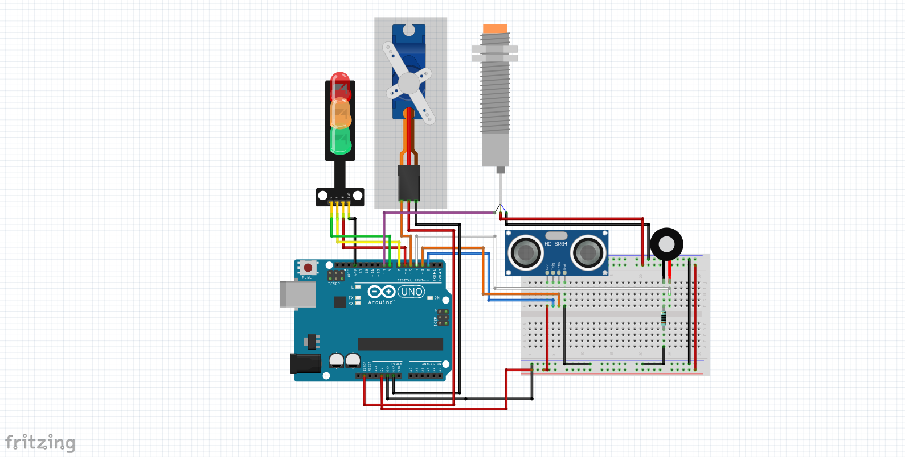

# 🚮 Smart Trash Bin Otomatis dengan Sensor Ultrasonik dan Sensor Logam

## 📌 Deskripsi Alat
Proyek ini adalah sistem **tempat sampah pintar** (smart trash bin) yang dapat mendeteksi keberadaan sampah dan menentukan apakah sampah tersebut mengandung **logam** atau tidak. Sistem ini memanfaatkan dua sensor utama:

- **Ultrasonic Sensor (HC-SR04)**: Untuk mendeteksi jarak objek (sampah) dari sensor.
- **Sensor Logam (Metal Detector)**: Untuk mendeteksi apakah objek mengandung logam.

Alat ini menggunakan **servo motor** untuk menggerakkan tutup tempat sampah ke **kanan atau kiri** secara otomatis berdasarkan hasil deteksi sensor.

Selain itu, sistem dilengkapi dengan:
- **LED indikator**: Merah, Kuning, dan Hijau untuk menunjukkan status alat.
- **Buzzer**: Sebagai notifikasi saat sampah terdeteksi.

---

## ⚙️ Cara Kerja Singkat

Alat ini hanya memiliki **satu lubang tempat sampah** di tengah, dan servo motor akan menggerakkan tutup ke kanan atau kiri berdasarkan kondisi sebagai berikut:

- Jika **hanya sensor ultrasonik yang aktif** (artinya mendeteksi objek tapi bukan logam):
  - Servo akan bergerak **ke kanan** *(contohnya untuk sampah biasa)*

- Jika **sensor ultrasonik dan sensor logam sama-sama aktif**:
  - Servo akan bergerak **ke kiri** *(contohnya untuk sampah logam)*

Setelah 3–4 detik, tutup akan **kembali ke posisi default (tengah)** dan sistem siap mendeteksi sampah berikutnya.

---

## 🔌 Komponen yang Digunakan

- 1x Arduino (Uno / Nano / lainnya)
- 1x HC-SR04 Ultrasonic Sensor
- 1x Sensor Logam (Metal Detector)
- 1x Servo Motor (SG90 atau lebih kuat)
- 3x LED (Merah, Kuning, Hijau)
- 1x Buzzer
- Kabel jumper secukupnya
- Breadboard / PCB
- Tempat sampah model prototype

---

## 💡 Fitur Tambahan

- **LED Hijau**: Sistem siap mendeteksi
- **LED Kuning & Merah**: Menyala saat proses deteksi dan aktivasi servo
- **Buzzer**: Berbunyi saat sampah terdeteksi
- **Serial Monitor**: Menampilkan jarak dan status deteksi logam secara real-time

---

## 🧠 Catatan Penggunaan

- Pastikan sensor ultrasonik menghadap langsung ke jalur masuk sampah
- Sensor logam harus diletakkan dekat jalur masuk agar bisa deteksi cepat
- Gunakan sumber daya yang cukup kuat jika servo sering macet
- Cek ulang posisi servo agar arah geraknya sesuai kanan/kiri
- Gunakan delay dan timing yang sesuai untuk membuka tutup secara stabil

---

## 📷 Sketsa Rangkaian

---

## 🛠️ Lisensi

Proyek ini **tidak open-source secara bebas**.

Seluruh kode, ide, dan desain dalam proyek ini **dilindungi oleh hak cipta**. Penggunaan ulang, modifikasi, distribusi, atau pengembangan lebih lanjut **tidak diperbolehkan tanpa izin tertulis dari pembuat asli**.

> Jika kamu ingin menggunakan proyek ini untuk keperluan pribadi, penelitian, pendidikan, lomba, atau pengembangan lebih lanjut, silakan hubungi terlebih dahulu untuk mendapatkan izin resmi.

© 2025 FarSyaFad Tech. All rights reserved.

---

